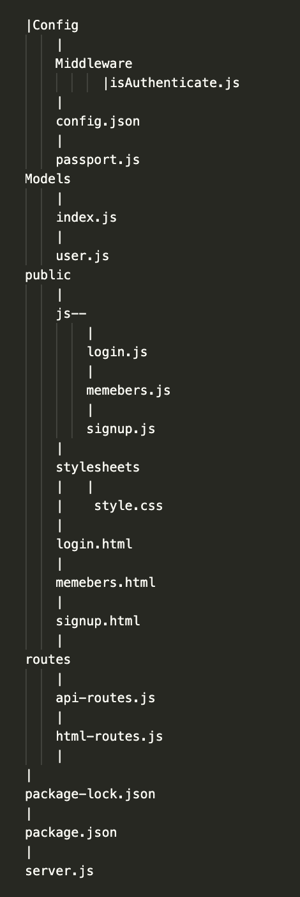

# analyze-code

This application provides a sign up form, a sign in form using passport and bcrypt to track user uniqueness and protect user input. Using MVC ( Model–view–controller), a software design pattern commonly, to develop user interfaces that divides the related program logic into three interconnected elements, in this case, Model-Public-Route.

## Google Docs  

[Google Docs](https://docs.google.com/document/d/11o0NUKUAqbb803xnsruhRUmvnuE8M8fghpOQKg5eAcg/edit?usp=sharing)  

# Page Structure 


# Table of Contents 
[Tittle](#analyze-code)

[Google Docs](#Google-Docs)

[Page Structure ](#Page-Structure )

[Table of Contents](#Table-of-Content)

[Description of Page Building](#Description-of-Page-Building)

[Code Snippet](#Code-Snippet)

[Technologies Used](#Technologies-Used)

[Author](#Author)

[License](#License)


## Description of Page Building 
* In server.js file 
   <ul> 
  <li> require all the nmp packages
  <li> Setting up port and requiring models for syncing
  <li> Creating express app and configuring middleware needed for authentication.
  <li> requiring routes from the routes folder
  <li> Syncing our database and logging a message to the user upon success
  <li> listen to port to kicks up the whole thing and starts the server
  </li>
  </ul>

* In js folder
  <ul> 
  <li> get document by id and class 
  <li> validate user data
  <li>  post to our "api/login" route
  <li> html route serves up html interface
  </li>
  </ul>


* In config folder
  <ul> 
  <li> Use Passport to authenticate requests.
  <li> Appply Passport-local strategy for authenticating with a username and password.
  <li>  serialize and deserialize the user input
  </li>
   </ul>


## Code Snippet
Install npm package 

Required variables 
``` Javascript
var express = require("express");
var session = require("express-session");
var passport = require("./config/passport");
var PORT = process.env.PORT || 8080;
var db = require("./models");
var app = express();
```

Set routes to handle when user "visit" the page 
``` Javascript
app.post("/api/login", passport.authenticate("local"), function(req, res) {
   res.json(req.user);
 });
app.get("/logout", function(req, res) {
   req.logout();
   res.redirect("/");
 });
```
bcrypt salt and hash of passord for safety 
``` Javascript
 User.addHook("beforeCreate", function(user) {
    user.password = bcrypt.hashSync(user.password, bcrypt.genSaltSync(10), null);
  });
  return User;
```

Passport to authenticate requests.
``` Javascript
passport.use(new LocalStrategy(
  {usernameField: "email"},
  function(email, password, done) {
      db.User.findOne({where: {email: email}
    }).then(function(dbUser) {
      if (!dbUser) {
        return done(null, false, {
          message: "Incorrect email."
        });}
      else if (!dbUser.validPassword(password)) {
        return done(null, false, {
          message: "Incorrect password."
        });}
      return done(null, dbUser);
    });}
));
```
Serialize takes your basic data structure and flatten it out into a string, by reading top to bottom. Now you have one big ass string. want to duplicate or extract, deserialize take that string and construct it again, make back into an object
``` Javascript 
passport.serializeUser(function(user, cb) {
 cb(null, user);
});
passport.deserializeUser(function(obj, cb) {
 cb(null, obj);}); 
module.exports = passport;
```

## Technologies Used
- Node - an open-source, cross-platform, back-end JavaScript runtime environment that executes JavaScript code outside a web browser.
  * [Node.js](https://nodejs.org/dist/latest-v14.x/docs/api/)
- Git - version control system to track changes to source code
  * [Git](https://git-scm.com/)
- GitHub - hosts repository that can be deployed to GitHub Pages
  * [Github](https://github.com/)
- Express - a Node js web application server framework, which is specifically designed for building single-page, multi-page, and hybrid web applications
  * [Express](http://expressjs.com/en/api.html#express)
- Bcryptjs - is a secured way to store passwords in database
  * [bcrypt](https://www.npmjs.com/package/bcryptjs)
- Express-session - Create a session middleware with the given option
  * [Express-session](https://www.npmjs.com/package/express-session)
- Mysql12 - Create a session middleware with the given option
  * [Mysql12](https://www.npmjs.com/package/mysql2)
- Passport - authenticate requests through an extensible set of plugins known as strategies.
  * [Passport](http://www.passportjs.org)
- Passport-local - a strategy authenticate users using a username and password
  * [Passport-local](http://www.passportjs.org/packages/passport-local/)
- Sequelize - Create table for database 
  * [Sequelize](https://sequelize.org/)

## Author

* **B Tram Vu** 

- [Link to Portfolio Site](https://vubao2303.github.io/portfolio/)
- [Link to Github](https://github.com/vubao2303)
- [Link to LinkedIn](https://www.linkedin.com/in/tram-vu-866250121/)

## License

© 2021 Trilogy Education Services, a 2U, Inc. brand. All Rights Reserved.

